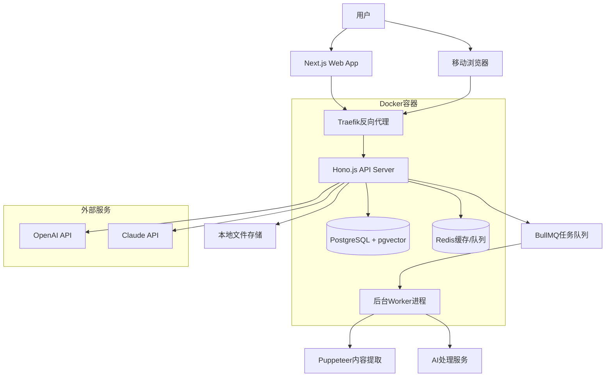
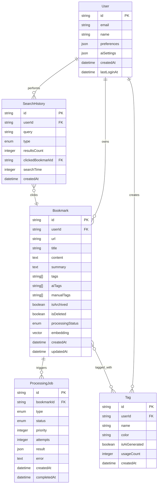

# NeoLink 智能书签管理系统全栈架构文档

**项目名称：** NeoLink - 可自托管的高性能轻量级智能书签管理系统  
**文档版本：** 1.0  
**创建日期：** 2025-01-15  
**架构师：** Winston  
**状态：** 完成，准备开发实施

---

## 📋 Introduction

### 文档范围

这个架构文档作为 AI 驱动开发的单一真实来源，确保整个技术栈的一致性。它结合了传统上分离的前端和后端架构文档，为现代全栈应用提供了流线化的开发流程。

### 关键输入文档确认

- ✅ **PRD 文档**：`docs/prd.md` - 包含完整的产品需求和技术约束
- ✅ **项目简介**：`docs/project-brief.md` - 提供业务背景和目标
- ✅ **技术栈选择**：Hono.js + oRPC + Next.js + shadcn/ui + PostgreSQL + Redis + Turborepo
- ✅ **架构模式**：Monorepo + 模块化单体架构

### Starter Template 分析

基于 PRD 分析，这是一个**Greenfield 项目**，没有基于现有的 starter template。我们将从零开始构建，但会考虑以下现代全栈 starter 的最佳实践：

- **T3 Stack 模式**：TypeScript 全栈类型安全
- **Turborepo 模式**：Monorepo 工具链和构建优化
- **Next.js 最佳实践**：App Router 和现代 React 模式
- **自托管优化**：Docker 化部署和运维简化

### 变更日志

| 日期       | 版本 | 描述                            | 作者              |
| ---------- | ---- | ------------------------------- | ----------------- |
| 2025-01-15 | 1.0  | 初始架构文档创建，基于 PRD v1.0 | Architect Winston |

---

## 🏗️ 高层架构

### 技术概览

NeoLink 采用**现代化自托管全栈架构**，结合**Monorepo + 模块化单体**设计模式。前端使用 Next.js 14 + shadcn/ui 提供现代化用户体验，后端采用 Hono.js + oRPC 确保类型安全的 API 通信。数据层使用 PostgreSQL + pgvector 支持传统查询和 AI 语义搜索，Redis 提供缓存和任务队列支持。整个系统通过 Docker 容器化部署，支持一键安装和自托管运维。

### 平台和基础设施选择

**最终选择：Docker 自托管**

- **平台**：Docker + Docker Compose
- **关键服务**：Traefik、PostgreSQL、Redis、应用容器
- **部署区域**：用户选择（全球任意位置）

### 仓库结构

**结构选择：Monorepo with Turborepo**

- **工具**：Turborepo + pnpm（高性能构建和缓存）
- **包组织**：按功能域分离，优化构建管道
- **构建优化**：增量构建、远程缓存、并行任务执行

```
neolink/
├── apps/
│   ├── web/          # Next.js前端应用
│   └── api/          # Hono.js后端API
├── packages/
│   ├── shared/       # 共享类型和工具
│   ├── database/     # 数据库schema和迁移
│   ├── ai/           # AI处理模块
│   ├── ui/           # shadcn/ui组件扩展
│   └── config/       # 共享配置（ESLint、TypeScript、Jest）
├── turbo.json        # Turborepo配置
├── package.json      # 根package.json
└── pnpm-workspace.yaml
```

### 高层架构图



### 架构模式

- **Jamstack + API-First**: 静态前端 + 动态 API，优化性能和 SEO
- **模块化单体架构**: 单一部署单元，模块化内部结构
- **事件驱动后台处理**: 异步任务队列处理 AI 和内容提取
- **Repository + Service 模式**: 分离数据访问和业务逻辑
- **API Gateway 模式**: 统一的 API 入口点
- **组件化 UI 架构**: 基于 shadcn/ui 的可复用组件系统

---

## 📊 数据模型

### 核心业务实体

#### Bookmark（书签）

**目的：** 核心业务实体，存储用户保存的网页书签及其所有相关信息，包括 AI 处理结果和元数据。

```typescript
interface Bookmark {
  id: string;
  url: string;
  title: string;
  description?: string;
  content?: string;
  summary?: string;
  favicon?: string;
  screenshot?: string;
  tags: string[];
  aiTags: string[];
  manualTags: string[];
  notes?: string;
  isArchived: boolean;
  isDeleted: boolean;
  processingStatus: ProcessingStatus;
  embedding?: number[];
  createdAt: Date;
  updatedAt: Date;
  userId: string;
}
```

#### ProcessingJob（处理任务）

**目的：** 跟踪 AI 和内容处理任务的状态，支持异步处理和错误恢复。

```typescript
interface ProcessingJob {
  id: string;
  bookmarkId: string;
  type: JobType;
  status: JobStatus;
  priority: number;
  attempts: number;
  maxAttempts: number;
  result?: any;
  error?: string;
  startedAt?: Date;
  completedAt?: Date;
  createdAt: Date;
}

enum JobType {
  SCREENSHOT = 'screenshot',
  CONTENT_EXTRACTION = 'content_extraction',
  AI_SUMMARY = 'ai_summary',
  AI_TAGS = 'ai_tags',
  VECTOR_EMBEDDING = 'vector_embedding',
}

enum JobStatus {
  PENDING = 'pending',
  PROCESSING = 'processing',
  COMPLETED = 'completed',
  FAILED = 'failed',
  CANCELLED = 'cancelled',
}
```

#### Tag（标签）

**目的：** 管理标签的元数据，支持标签统计、分类和智能建议。

```typescript
interface Tag {
  id: string;
  name: string;
  color?: string;
  description?: string;
  isAiGenerated: boolean;
  usageCount: number;
  createdAt: Date;
  userId: string;
}
```

#### User（用户）

**目的：** 用户账户信息和偏好设置，为未来多用户支持做准备。

```typescript
interface User {
  id: string;
  email: string;
  name?: string;
  preferences: UserPreferences;
  aiSettings: AISettings;
  createdAt: Date;
  lastLoginAt?: Date;
}

interface UserPreferences {
  theme: 'light' | 'dark' | 'system';
  language: string;
  defaultView: 'grid' | 'list';
  itemsPerPage: number;
  enableNotifications: boolean;
}

interface AISettings {
  enableAISummary: boolean;
  enableAITags: boolean;
  aiProvider: 'openai' | 'claude';
  summaryLength: 'short' | 'medium' | 'long';
  monthlyBudget: number;
  currentSpend: number;
}
```

### 数据模型关系图



---

## 🔌 API 规范

### oRPC 路由器定义

```typescript
// packages/shared/src/api/bookmarks.ts
import { z } from 'zod';
import { procedure, router } from '@orpc/server';
import {
  BookmarkSchema,
  CreateBookmarkSchema,
  UpdateBookmarkSchema,
} from '../schemas';

export const bookmarksRouter = router({
  // 创建书签
  create: procedure
    .input(CreateBookmarkSchema)
    .output(BookmarkSchema)
    .mutation(async ({ input, context }) => {
      // 实现逻辑
    }),

  // 获取书签列表
  list: procedure
    .input(
      z.object({
        page: z.number().min(1).default(1),
        limit: z.number().min(1).max(100).default(20),
        search: z.string().optional(),
        tags: z.array(z.string()).optional(),
        isArchived: z.boolean().optional(),
        sortBy: z
          .enum(['createdAt', 'updatedAt', 'title'])
          .default('createdAt'),
        sortOrder: z.enum(['asc', 'desc']).default('desc'),
      })
    )
    .output(
      z.object({
        bookmarks: z.array(BookmarkSchema),
        total: z.number(),
        page: z.number(),
        totalPages: z.number(),
      })
    )
    .query(async ({ input, context }) => {
      // 实现逻辑
    }),

  // 获取单个书签
  get: procedure
    .input(z.object({ id: z.string().uuid() }))
    .output(BookmarkSchema)
    .query(async ({ input, context }) => {
      // 实现逻辑
    }),

  // 更新书签
  update: procedure
    .input(
      z.object({
        id: z.string().uuid(),
        data: UpdateBookmarkSchema,
      })
    )
    .output(BookmarkSchema)
    .mutation(async ({ input, context }) => {
      // 实现逻辑
    }),

  // 删除书签（软删除）
  delete: procedure
    .input(z.object({ id: z.string().uuid() }))
    .output(z.object({ success: z.boolean() }))
    .mutation(async ({ input, context }) => {
      // 实现逻辑
    }),
});
```

### 主路由器组合

```typescript
// packages/shared/src/api/index.ts
export const appRouter = router({
  bookmarks: bookmarksRouter,
  search: searchRouter,
  ai: aiRouter,
  tags: tagsRouter,
  data: dataRouter,
  system: systemRouter,
});

export type AppRouter = typeof appRouter;
```

### 前端客户端使用示例

```typescript
// apps/web/src/lib/api-client.ts
import { createORPCClient } from '@orpc/client';
import type { AppRouter } from '@neolink/shared/api';

export const api = createORPCClient<AppRouter>({
  baseURL: process.env.NEXT_PUBLIC_API_URL || 'http://localhost:3001',
  headers: {
    'Content-Type': 'application/json',
  },
});

// 使用示例
const bookmarks = await api.bookmarks.list({
  page: 1,
  limit: 20,
  search: 'react',
});

const newBookmark = await api.bookmarks.create({
  url: 'https://example.com',
  title: 'Example Site',
});
```

---

## 🧩 组件架构

### 前端组件架构

#### UI 组件层次结构

**基础组件 (packages/ui)**

- **目的**：提供可复用的基础 UI 组件，基于 shadcn/ui 扩展
- **关键接口**：标准化的 props 接口、主题和样式系统、无障碍访问支持
- **依赖**：Radix UI、Tailwind CSS、Lucide React
- **技术细节**：TypeScript + React + Storybook 文档

```typescript
// packages/ui/src/components/Button/Button.tsx
interface ButtonProps extends React.ButtonHTMLAttributes<HTMLButtonElement> {
  variant?:
    | "default"
    | "destructive"
    | "outline"
    | "secondary"
    | "ghost"
    | "link";
  size?: "default" | "sm" | "lg" | "icon";
  loading?: boolean;
}

export const Button = React.forwardRef<HTMLButtonElement, ButtonProps>(
  (
    { className, variant = "default", size = "default", loading, ...props },
    ref
  ) => {
    return (
      <button
        className={cn(buttonVariants({ variant, size, className }))}
        ref={ref}
        disabled={loading || props.disabled}
        {...props}
      >
        {loading && <Loader2 className="mr-2 h-4 w-4 animate-spin" />}
        {props.children}
      </button>
    );
  }
);
```

**业务组件 (apps/web/src/components)**

- **目的**：实现特定业务逻辑的复合组件
- **关键接口**：BookmarkCard、BookmarkList、SearchBar、TagManager、AIStatusIndicator
- **依赖**：基础组件、API 客户端、状态管理
- **技术细节**：React + Zustand + React Hook Form

#### 状态管理架构

**全局状态 (Zustand Store)**

```typescript
// apps/web/src/stores/bookmarks.ts
interface BookmarksState {
  bookmarks: Bookmark[];
  loading: boolean;
  error: string | null;
  filters: BookmarkFilters;
  pagination: PaginationState;

  // Actions
  fetchBookmarks: () => Promise<void>;
  createBookmark: (data: CreateBookmarkInput) => Promise<void>;
  updateBookmark: (id: string, data: UpdateBookmarkInput) => Promise<void>;
  deleteBookmark: (id: string) => Promise<void>;
  setFilters: (filters: Partial<BookmarkFilters>) => void;
  clearError: () => void;
}

export const useBookmarksStore = create<BookmarksState>((set, get) => ({
  bookmarks: [],
  loading: false,
  error: null,
  filters: defaultFilters,
  pagination: defaultPagination,

  fetchBookmarks: async () => {
    set({ loading: true, error: null });
    try {
      const { filters, pagination } = get();
      const result = await api.bookmarks.list({
        ...filters,
        page: pagination.page,
        limit: pagination.limit,
      });
      set({
        bookmarks: result.bookmarks,
        pagination: { ...pagination, total: result.total },
        loading: false,
      });
    } catch (error) {
      set({ error: error.message, loading: false });
    }
  },
}));
```

### 后端服务组件

#### 核心服务层

**BookmarkService**

- **职责**：书签的业务逻辑处理
- **关键接口**：createBookmark、updateBookmark、deleteBookmark、searchBookmarks
- **依赖**：BookmarkRepository、AIService、SearchService
- **技术细节**：TypeScript + 依赖注入

**AIService**

- **职责**：AI 功能的统一接口和成本控制
- **关键接口**：generateSummary、generateTags、generateEmbedding
- **依赖**：OpenAI Client、Claude Client、CacheService
- **技术细节**：多 AI 提供商支持 + 智能缓存

**ContentService**

- **职责**：网页内容提取和处理
- **关键接口**：extractContent、takeScreenshot、optimizeForReading
- **依赖**：Puppeteer、Readability.js、FileStorage
- **技术细节**：无头浏览器 + 内容优化

#### 数据访问层

**Repository 模式实现**

```typescript
// apps/api/src/repositories/BookmarkRepository.ts
export class BookmarkRepository {
  constructor(private db: Database) {}

  async create(data: CreateBookmarkData): Promise<Bookmark> {
    const [bookmark] = await this.db.insert(bookmarks).values(data).returning();

    return bookmark;
  }

  async findById(id: string, userId: string): Promise<Bookmark | null> {
    const bookmark = await this.db
      .select()
      .from(bookmarks)
      .where(
        and(
          eq(bookmarks.id, id),
          eq(bookmarks.userId, userId),
          eq(bookmarks.isDeleted, false)
        )
      )
      .limit(1);

    return bookmark[0] || null;
  }
}
```

---

## � 外部 API 集成

### AI 服务集成架构

#### OpenAI API 集成

**目的：** 主要 AI 服务提供商，用于内容摘要、标签生成和向量嵌入
**关键接口：** GPT-4o-mini for 文本摘要和标签生成、text-embedding-3-small for 向量嵌入

```typescript
// packages/ai/src/providers/OpenAIProvider.ts
export class OpenAIProvider implements AIProvider {
  private client: OpenAI;
  private cache: CacheService;
  private costTracker: CostTracker;

  constructor(config: OpenAIConfig) {
    this.client = new OpenAI({
      apiKey: config.apiKey,
      timeout: 30000,
      maxRetries: 3,
    });
    this.cache = new CacheService(config.redis);
    this.costTracker = new CostTracker(config.costLimits);
  }

  async generateSummary(
    content: string,
    options: SummaryOptions = {}
  ): Promise<SummaryResult> {
    // 1. 成本检查
    await this.costTracker.checkBudget('summary');

    // 2. 缓存检查
    const cacheKey = this.generateCacheKey('summary', content, options);
    const cached = await this.cache.get(cacheKey);
    if (cached) return cached;

    // 3. API调用
    const response = await this.client.chat.completions.create({
      model: 'gpt-4o-mini',
      messages: [
        {
          role: 'system',
          content: this.getSummarySystemPrompt(options),
        },
        {
          role: 'user',
          content: this.preprocessContent(content, options.maxLength || 4000),
        },
      ],
      max_tokens:
        options.summaryLength === 'short'
          ? 100
          : options.summaryLength === 'long'
            ? 300
            : 200,
      temperature: 0.3,
    });

    const summary = response.choices[0]?.message?.content?.trim();
    if (!summary) {
      throw new AIError('Failed to generate summary');
    }

    // 4. 成本记录和缓存
    await this.costTracker.recordUsage('summary', {
      inputTokens: response.usage?.prompt_tokens || 0,
      outputTokens: response.usage?.completion_tokens || 0,
      cost: this.calculateCost(response.usage),
    });

    const result: SummaryResult = {
      summary,
      confidence: this.calculateConfidence(response),
      language: await this.detectLanguage(summary),
    };

    await this.cache.set(cacheKey, result, { ttl: 7 * 24 * 3600 });
    return result;
  }
}
```

#### AI 服务统一接口

```typescript
// packages/ai/src/AIService.ts
export class AIService {
  private providers: Map<string, AIProvider>;
  private config: AIConfig;
  private fallbackChain: string[];

  constructor(config: AIConfig) {
    this.config = config;
    this.providers = new Map();
    this.fallbackChain = ['openai', 'claude'];

    // 初始化提供商
    if (config.openai?.enabled) {
      this.providers.set('openai', new OpenAIProvider(config.openai));
    }
    if (config.claude?.enabled) {
      this.providers.set('claude', new ClaudeProvider(config.claude));
    }
  }

  async generateSummary(
    content: string,
    options: SummaryOptions = {}
  ): Promise<SummaryResult> {
    const provider =
      options.provider || this.config.defaultProvider || 'openai';
    return this.executeWithFallback(
      'generateSummary',
      provider,
      content,
      options
    );
  }

  private async executeWithFallback<T>(
    method: keyof AIProvider,
    primaryProvider: string,
    ...args: any[]
  ): Promise<T> {
    const providers = [
      primaryProvider,
      ...this.fallbackChain.filter((p) => p !== primaryProvider),
    ];

    for (const providerName of providers) {
      const provider = this.providers.get(providerName);
      if (!provider) continue;

      try {
        return await (provider[method] as any)(...args);
      } catch (error) {
        console.warn(`AI provider ${providerName} failed:`, error.message);

        // 如果是成本限制错误，不要fallback
        if (error instanceof BudgetExceededError) {
          throw error;
        }

        continue;
      }
    }

    throw new AIError('All AI providers failed');
  }
}
```

### 内容提取服务集成

#### Puppeteer 集成

**目的：** 网页内容提取、截图生成和 JavaScript 渲染

```typescript
// packages/ai/src/services/ContentExtractionService.ts
export class ContentExtractionService {
  private browser: Browser | null = null;
  private config: ContentConfig;

  constructor(config: ContentConfig) {
    this.config = config;
  }

  async extractContent(url: string): Promise<ExtractedContent> {
    const browser = await this.getBrowser();
    const page = await browser.newPage();

    try {
      // 配置页面
      await page.setViewport({ width: 1200, height: 800 });
      await page.setUserAgent(this.config.userAgent);

      // 导航到页面
      await page.goto(url, {
        waitUntil: 'networkidle2',
        timeout: 30000,
      });

      // 提取基础信息
      const basicInfo = await page.evaluate(() => ({
        title: document.title,
        description:
          document
            .querySelector('meta[name="description"]')
            ?.getAttribute('content') || '',
        favicon:
          document.querySelector('link[rel="icon"]')?.getAttribute('href') ||
          '',
        author:
          document
            .querySelector('meta[name="author"]')
            ?.getAttribute('content') || '',
      }));

      // 获取页面HTML和截图
      const html = await page.content();
      const screenshot = await this.takeScreenshot(page, url);

      // 提取主要内容
      const readableContent = await this.extractReadableContent(html, url);

      return {
        url,
        title: basicInfo.title,
        description: basicInfo.description,
        favicon: this.resolveUrl(basicInfo.favicon, url),
        author: basicInfo.author,
        content: readableContent.content,
        textContent: readableContent.textContent,
        screenshot,
        extractedAt: new Date(),
      };
    } finally {
      await page.close();
    }
  }

  private async getBrowser(): Promise<Browser> {
    if (!this.browser) {
      this.browser = await puppeteer.launch({
        headless: true,
        args: [
          '--no-sandbox',
          '--disable-setuid-sandbox',
          '--disable-dev-shm-usage',
          '--disable-gpu',
        ],
      });
    }

    return this.browser;
  }
}
```

---

## 🚀 部署和基础设施

### 容器化架构

#### Docker 容器设计

**应用容器 (neolink-app)**

- **基础镜像**：node:20-alpine（轻量级，安全性好）
- **端口暴露**：3000（前端）、3001（后端 API）
- **环境变量**：数据库连接、AI API 密钥、Redis 配置
- **健康检查**：HTTP 健康检查端点

```dockerfile
# Dockerfile
FROM node:20-alpine AS base

# 安装依赖
RUN apk add --no-cache libc6-compat
WORKDIR /app

# 安装pnpm和Turborepo
RUN npm install -g pnpm turbo

# 复制依赖文件
COPY package.json pnpm-lock.yaml pnpm-workspace.yaml turbo.json ./
COPY apps/web/package.json ./apps/web/
COPY apps/api/package.json ./apps/api/
COPY packages/*/package.json ./packages/*/

# 安装依赖
RUN pnpm install --frozen-lockfile

# 复制源代码
COPY . .

# 构建应用
RUN turbo build

# 生产阶段
FROM node:20-alpine AS production
WORKDIR /app

# 安装运行时依赖
RUN apk add --no-cache \
    chromium \
    nss \
    freetype \
    freetype-dev \
    harfbuzz \
    ca-certificates \
    ttf-freefont

# 设置Puppeteer使用系统Chromium
ENV PUPPETEER_SKIP_CHROMIUM_DOWNLOAD=true \
    PUPPETEER_EXECUTABLE_PATH=/usr/bin/chromium-browser

# 复制构建产物
COPY --from=base /app/apps/web/.next ./apps/web/.next
COPY --from=base /app/apps/api/dist ./apps/api/dist
COPY --from=base /app/node_modules ./node_modules
COPY --from=base /app/package.json ./

# 创建非root用户
RUN addgroup -g 1001 -S nodejs
RUN adduser -S neolink -u 1001
USER neolink

# 暴露端口
EXPOSE 3000 3001

# 健康检查
HEALTHCHECK --interval=30s --timeout=3s --start-period=5s --retries=3 \
  CMD curl -f http://localhost:3001/health || exit 1

# 启动命令
CMD ["node", "apps/api/dist/index.js"]
```

### Docker Compose 配置

```yaml
# docker-compose.yml
version: '3.8'

services:
  # 反向代理和SSL终止
  traefik:
    image: traefik:v3.0
    container_name: neolink-traefik
    restart: unless-stopped
    ports:
      - '80:80'
      - '443:443'
      - '8080:8080'
    volumes:
      - /var/run/docker.sock:/var/run/docker.sock:ro
      - ./traefik:/etc/traefik
      - ./data/traefik:/data
    environment:
      - TRAEFIK_API_DASHBOARD=true
      - TRAEFIK_PROVIDERS_DOCKER=true
      - TRAEFIK_ENTRYPOINTS_WEB_ADDRESS=:80
      - TRAEFIK_ENTRYPOINTS_WEBSECURE_ADDRESS=:443
      - TRAEFIK_CERTIFICATESRESOLVERS_LETSENCRYPT_ACME_EMAIL=${ACME_EMAIL}

  # 主应用
  app:
    build: .
    container_name: neolink-app
    restart: unless-stopped
    depends_on:
      - db
      - redis
    environment:
      - NODE_ENV=production
      - DATABASE_URL=postgresql://${DB_USER}:${DB_PASSWORD}@db:5432/${DB_NAME}
      - REDIS_URL=redis://redis:6379
      - OPENAI_API_KEY=${OPENAI_API_KEY}
      - CLAUDE_API_KEY=${CLAUDE_API_KEY}
      - JWT_SECRET=${JWT_SECRET}
    volumes:
      - ./data/uploads:/app/uploads
      - ./data/screenshots:/app/screenshots
      - ./data/backups:/app/backups
    labels:
      - 'traefik.enable=true'
      - 'traefik.http.routers.app.rule=Host(`${DOMAIN}`)'
      - 'traefik.http.routers.app.tls.certresolver=letsencrypt'

  # PostgreSQL数据库
  db:
    image: pgvector/pgvector:pg15
    container_name: neolink-db
    restart: unless-stopped
    environment:
      - POSTGRES_DB=${DB_NAME}
      - POSTGRES_USER=${DB_USER}
      - POSTGRES_PASSWORD=${DB_PASSWORD}
    volumes:
      - ./data/postgres:/var/lib/postgresql/data
      - ./scripts/init-db.sql:/docker-entrypoint-initdb.d/init-db.sql
    healthcheck:
      test: ['CMD-SHELL', 'pg_isready -U ${DB_USER} -d ${DB_NAME}']
      interval: 30s
      timeout: 10s
      retries: 3

  # Redis缓存和队列
  redis:
    image: redis:7-alpine
    container_name: neolink-redis
    restart: unless-stopped
    command: redis-server --appendonly yes --maxmemory 256mb --maxmemory-policy allkeys-lru
    volumes:
      - ./data/redis:/data
    healthcheck:
      test: ['CMD', 'redis-cli', 'ping']
      interval: 30s
      timeout: 10s
      retries: 3

  # 后台任务处理器
  worker:
    build: .
    container_name: neolink-worker
    restart: unless-stopped
    command: ['node', 'apps/api/dist/worker.js']
    depends_on:
      - db
      - redis
    environment:
      - NODE_ENV=production
      - DATABASE_URL=postgresql://${DB_USER}:${DB_PASSWORD}@db:5432/${DB_NAME}
      - REDIS_URL=redis://redis:6379
      - OPENAI_API_KEY=${OPENAI_API_KEY}
      - CLAUDE_API_KEY=${CLAUDE_API_KEY}
      - WORKER_CONCURRENCY=3
    volumes:
      - ./data/uploads:/app/uploads
      - ./data/screenshots:/app/screenshots
```

---

## 🔒 安全考虑

### 身份认证和授权

#### JWT 认证系统

**目的：** 提供无状态的用户认证，支持单用户和未来多用户扩展
**关键特性：** 访问令牌 + 刷新令牌机制，防止令牌劫持

```typescript
// packages/shared/src/auth/AuthService.ts
export class AuthService {
  private jwtSecret: string;
  private refreshSecret: string;
  private redis: Redis;

  constructor(config: AuthConfig) {
    this.jwtSecret = config.jwtSecret;
    this.refreshSecret = config.refreshSecret;
    this.redis = config.redis;
  }

  async generateTokens(userId: string): Promise<TokenPair> {
    const payload = {
      userId,
      type: 'access',
      iat: Math.floor(Date.now() / 1000),
    };

    // 生成访问令牌（15分钟有效期）
    const accessToken = jwt.sign(payload, this.jwtSecret, {
      expiresIn: '15m',
      issuer: 'neolink',
      audience: 'neolink-api',
    });

    // 生成刷新令牌（7天有效期）
    const refreshPayload = {
      userId,
      type: 'refresh',
      tokenId: crypto.randomUUID(),
      iat: Math.floor(Date.now() / 1000),
    };

    const refreshToken = jwt.sign(refreshPayload, this.refreshSecret, {
      expiresIn: '7d',
      issuer: 'neolink',
      audience: 'neolink-api',
    });

    // 存储刷新令牌到Redis（支持撤销）
    await this.redis.setex(
      `refresh_token:${refreshPayload.tokenId}`,
      7 * 24 * 3600,
      JSON.stringify({ userId, createdAt: new Date().toISOString() })
    );

    return {
      accessToken,
      refreshToken,
      expiresIn: 15 * 60,
      tokenType: 'Bearer',
    };
  }
}
```

### 数据保护

#### 传输加密

**TLS 1.3 配置：**

```yaml
# traefik/traefik.yml
entryPoints:
  web:
    address: ':80'
    http:
      redirections:
        entrypoint:
          to: websecure
          scheme: https
          permanent: true
  websecure:
    address: ':443'
    http:
      tls:
        options: default

tls:
  options:
    default:
      minVersion: 'VersionTLS13'
      cipherSuites:
        - 'TLS_AES_256_GCM_SHA384'
        - 'TLS_CHACHA20_POLY1305_SHA256'
        - 'TLS_AES_128_GCM_SHA256'
```

#### API 安全

**速率限制：**

```typescript
// apps/api/src/middleware/rateLimit.ts
export class RateLimitMiddleware {
  private redis: Redis;
  private limits: RateLimitConfig;

  constructor(redis: Redis, limits: RateLimitConfig) {
    this.redis = redis;
    this.limits = limits;
  }

  createRateLimit(tier: 'default' | 'authenticated' | 'premium') {
    return procedure.use(async ({ next, context }) => {
      const config = this.limits[tier];
      const identifier = this.getIdentifier(context, tier);
      const key = `rate_limit:${tier}:${identifier}`;

      // 使用滑动窗口算法
      const now = Date.now();
      const windowStart = now - config.windowMs;

      // 清理过期记录
      await this.redis.zremrangebyscore(key, 0, windowStart);

      // 获取当前窗口内的请求数
      const currentRequests = await this.redis.zcard(key);

      if (currentRequests >= config.maxRequests) {
        throw new TooManyRequestsError('Rate limit exceeded');
      }

      // 记录当前请求
      await this.redis.zadd(key, now, `${now}-${Math.random()}`);
      await this.redis.expire(key, Math.ceil(config.windowMs / 1000));

      return next();
    });
  }
}
```

### 隐私保护

#### GDPR 合规

```typescript
// packages/shared/src/privacy/PrivacyService.ts
export class PrivacyService {
  // 数据导出（GDPR第20条 - 数据可携带权）
  async exportUserData(userId: string): Promise<UserDataExport> {
    const user = await this.userRepository.findById(userId);
    const bookmarks = await this.bookmarkRepository.findByUserId(userId);

    return {
      user: {
        id: user.id,
        email: user.email,
        name: user.name,
        createdAt: user.createdAt,
        preferences: user.preferences,
      },
      bookmarks: bookmarks.map((bookmark) => ({
        id: bookmark.id,
        url: bookmark.url,
        title: bookmark.title,
        tags: bookmark.tags,
        createdAt: bookmark.createdAt,
      })),
      exportedAt: new Date(),
      format: 'JSON',
      version: '1.0',
    };
  }

  // 数据删除（GDPR第17条 - 被遗忘权）
  async deleteUserData(
    userId: string,
    reason: string
  ): Promise<DeletionReport> {
    const deletionReport: DeletionReport = {
      userId,
      requestedAt: new Date(),
      reason,
      deletedItems: [],
    };

    // 删除书签和相关数据
    const bookmarks = await this.bookmarkRepository.findByUserId(userId);
    for (const bookmark of bookmarks) {
      if (bookmark.screenshot) {
        await this.fileService.deleteFile(bookmark.screenshot);
      }
      await this.bookmarkRepository.hardDelete(bookmark.id);

      deletionReport.deletedItems.push({
        type: 'bookmark',
        id: bookmark.id,
        deletedAt: new Date(),
      });
    }

    // 删除用户账户
    await this.userRepository.hardDelete(userId);

    return deletionReport;
  }
}
```

---

**文档状态：** ✅ 完成
**最后更新：** 2025-01-15
**下一里程碑：** 开发实施和架构验证
